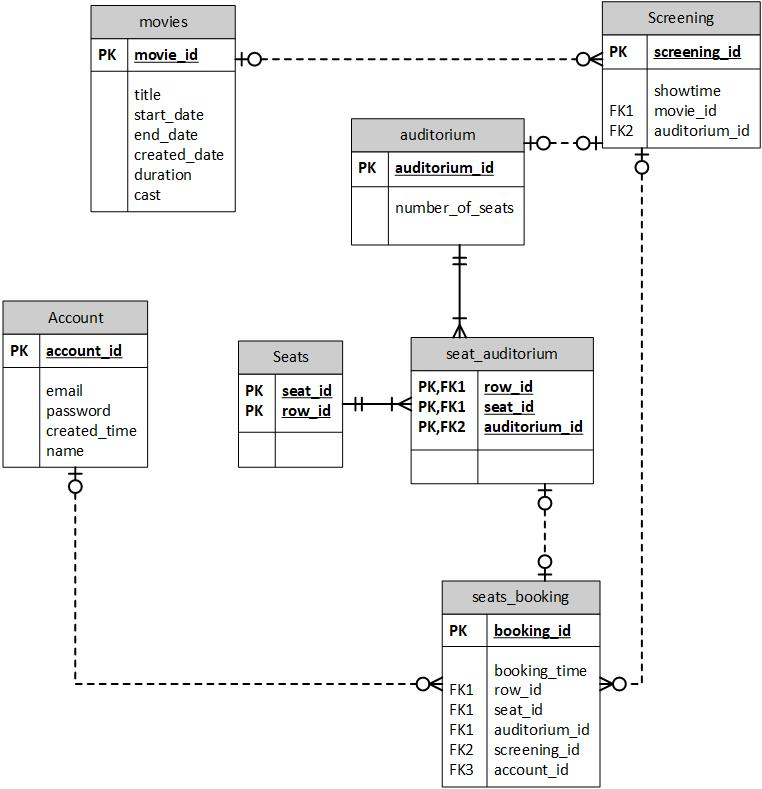

# Booking-system-practice
This is a backend system for a movie booking system.
 
This project is to enhance my understanding of springboot framework, unit and integration testing.

# Tools Used
* Spring boot
* Dockers - Postgresql
* JPA
* BDDMockito
* Junit

# ERD
This overview captures the relationship between the different entities and the overall design



# Run
```Bash
docker-compose up -d
```
Proceed to http://localhost:8080/ which you should see "hello". This means that the code is working and you can proceed to query for any of the APIs.

# APIs
* [Auditorium Api](./docs/AUDITORIUM_README.md)
* [Movie Api](./docs/MOVIE_README.md)
* [Seat Api](./docs/SEAT_README.md)
* [Screening Api](./docs/SCREENING_README.md)
* [Seat Auditorim Api](./docs/SEATAUDITORIUM_README.md)
* [Auditorium Api](./docs/SEATBOOKING_README.md)

# Future Improvements
1. A primary id could be added for seat_auditorium since it would ease the number of ids needed for other entities

2. JWT to be implemented onto the system. Hence, the current design doesn't include much implementation for Account entity since there would be changes in the future. 
